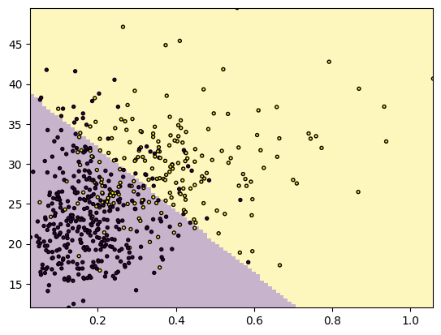
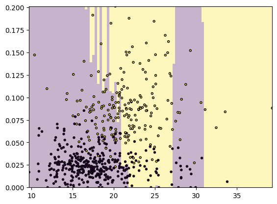
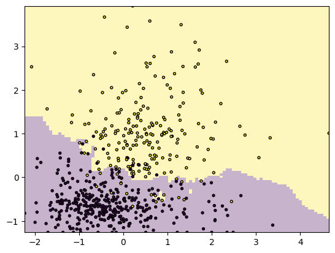
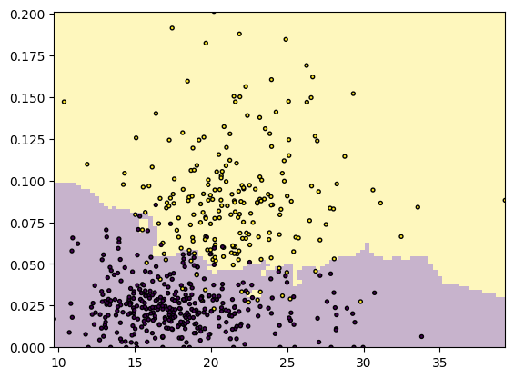
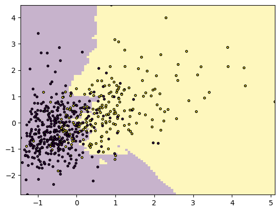
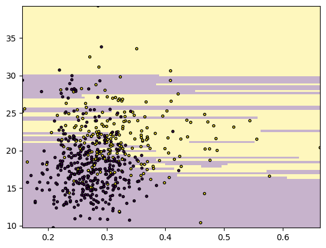
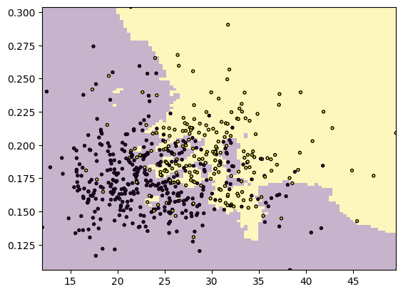
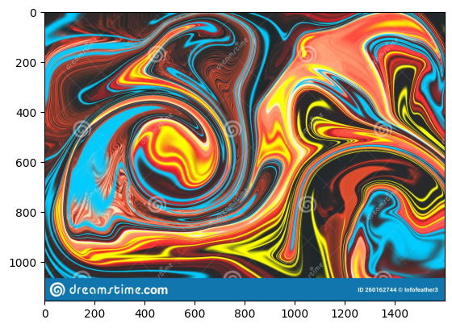
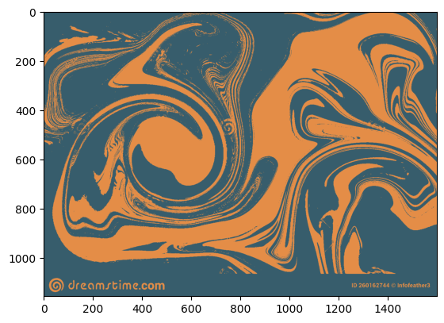
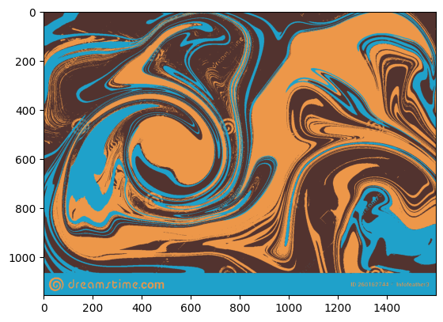

### Importing Data


```python
import pandas as pd
import numpy as np
df = pd.read_csv("data/wdbc.csv.bz2")
del df['id']
df = df.dropna()
df
```


<div>
<style scoped>
    .dataframe tbody tr th:only-of-type {
        vertical-align: middle;
    }

    .dataframe tbody tr th {
        vertical-align: top;
    }

    .dataframe thead th {
        text-align: right;
    }
</style>
<table border="1" class="dataframe">
  <thead>
    <tr style="text-align: right;">
      <th></th>
      <th>diagnosis</th>
      <th>radius.mean</th>
      <th>texture.mean</th>
      <th>perimeter.mean</th>
      <th>area.mean</th>
      <th>smoothness.mean</th>
      <th>compactness.mean</th>
      <th>concavity.mean</th>
      <th>concpoints.mean</th>
      <th>symmetry.mean</th>
      <th>...</th>
      <th>radius.worst</th>
      <th>texture.worst</th>
      <th>perimeter.worst</th>
      <th>area.worst</th>
      <th>smoothness.worst</th>
      <th>compactness.worst</th>
      <th>concavity.worst</th>
      <th>concpoints.worst</th>
      <th>symmetry.worst</th>
      <th>fracdim.worst</th>
    </tr>
  </thead>
  <tbody>
    <tr>
      <th>0</th>
      <td>M</td>
      <td>17.99</td>
      <td>10.38</td>
      <td>122.80</td>
      <td>1001.0</td>
      <td>0.11840</td>
      <td>0.27760</td>
      <td>0.30010</td>
      <td>0.14710</td>
      <td>0.2419</td>
      <td>...</td>
      <td>25.380</td>
      <td>17.33</td>
      <td>184.60</td>
      <td>2019.0</td>
      <td>0.16220</td>
      <td>0.66560</td>
      <td>0.7119</td>
      <td>0.2654</td>
      <td>0.4601</td>
      <td>0.11890</td>
    </tr>
    <tr>
      <th>1</th>
      <td>M</td>
      <td>20.57</td>
      <td>17.77</td>
      <td>132.90</td>
      <td>1326.0</td>
      <td>0.08474</td>
      <td>0.07864</td>
      <td>0.08690</td>
      <td>0.07017</td>
      <td>0.1812</td>
      <td>...</td>
      <td>24.990</td>
      <td>23.41</td>
      <td>158.80</td>
      <td>1956.0</td>
      <td>0.12380</td>
      <td>0.18660</td>
      <td>0.2416</td>
      <td>0.1860</td>
      <td>0.2750</td>
      <td>0.08902</td>
    </tr>
    <tr>
      <th>2</th>
      <td>M</td>
      <td>19.69</td>
      <td>21.25</td>
      <td>130.00</td>
      <td>1203.0</td>
      <td>0.10960</td>
      <td>0.15990</td>
      <td>0.19740</td>
      <td>0.12790</td>
      <td>0.2069</td>
      <td>...</td>
      <td>23.570</td>
      <td>25.53</td>
      <td>152.50</td>
      <td>1709.0</td>
      <td>0.14440</td>
      <td>0.42450</td>
      <td>0.4504</td>
      <td>0.2430</td>
      <td>0.3613</td>
      <td>0.08758</td>
    </tr>
    <tr>
      <th>3</th>
      <td>M</td>
      <td>11.42</td>
      <td>20.38</td>
      <td>77.58</td>
      <td>386.1</td>
      <td>0.14250</td>
      <td>0.28390</td>
      <td>0.24140</td>
      <td>0.10520</td>
      <td>0.2597</td>
      <td>...</td>
      <td>14.910</td>
      <td>26.50</td>
      <td>98.87</td>
      <td>567.7</td>
      <td>0.20980</td>
      <td>0.86630</td>
      <td>0.6869</td>
      <td>0.2575</td>
      <td>0.6638</td>
      <td>0.17300</td>
    </tr>
    <tr>
      <th>4</th>
      <td>M</td>
      <td>20.29</td>
      <td>14.34</td>
      <td>135.10</td>
      <td>1297.0</td>
      <td>0.10030</td>
      <td>0.13280</td>
      <td>0.19800</td>
      <td>0.10430</td>
      <td>0.1809</td>
      <td>...</td>
      <td>22.540</td>
      <td>16.67</td>
      <td>152.20</td>
      <td>1575.0</td>
      <td>0.13740</td>
      <td>0.20500</td>
      <td>0.4000</td>
      <td>0.1625</td>
      <td>0.2364</td>
      <td>0.07678</td>
    </tr>
    <tr>
      <th>...</th>
      <td>...</td>
      <td>...</td>
      <td>...</td>
      <td>...</td>
      <td>...</td>
      <td>...</td>
      <td>...</td>
      <td>...</td>
      <td>...</td>
      <td>...</td>
      <td>...</td>
      <td>...</td>
      <td>...</td>
      <td>...</td>
      <td>...</td>
      <td>...</td>
      <td>...</td>
      <td>...</td>
      <td>...</td>
      <td>...</td>
      <td>...</td>
    </tr>
    <tr>
      <th>564</th>
      <td>M</td>
      <td>21.56</td>
      <td>22.39</td>
      <td>142.00</td>
      <td>1479.0</td>
      <td>0.11100</td>
      <td>0.11590</td>
      <td>0.24390</td>
      <td>0.13890</td>
      <td>0.1726</td>
      <td>...</td>
      <td>25.450</td>
      <td>26.40</td>
      <td>166.10</td>
      <td>2027.0</td>
      <td>0.14100</td>
      <td>0.21130</td>
      <td>0.4107</td>
      <td>0.2216</td>
      <td>0.2060</td>
      <td>0.07115</td>
    </tr>
    <tr>
      <th>565</th>
      <td>M</td>
      <td>20.13</td>
      <td>28.25</td>
      <td>131.20</td>
      <td>1261.0</td>
      <td>0.09780</td>
      <td>0.10340</td>
      <td>0.14400</td>
      <td>0.09791</td>
      <td>0.1752</td>
      <td>...</td>
      <td>23.690</td>
      <td>38.25</td>
      <td>155.00</td>
      <td>1731.0</td>
      <td>0.11660</td>
      <td>0.19220</td>
      <td>0.3215</td>
      <td>0.1628</td>
      <td>0.2572</td>
      <td>0.06637</td>
    </tr>
    <tr>
      <th>566</th>
      <td>M</td>
      <td>16.60</td>
      <td>28.08</td>
      <td>108.30</td>
      <td>858.1</td>
      <td>0.08455</td>
      <td>0.10230</td>
      <td>0.09251</td>
      <td>0.05302</td>
      <td>0.1590</td>
      <td>...</td>
      <td>18.980</td>
      <td>34.12</td>
      <td>126.70</td>
      <td>1124.0</td>
      <td>0.11390</td>
      <td>0.30940</td>
      <td>0.3403</td>
      <td>0.1418</td>
      <td>0.2218</td>
      <td>0.07820</td>
    </tr>
    <tr>
      <th>567</th>
      <td>M</td>
      <td>20.60</td>
      <td>29.33</td>
      <td>140.10</td>
      <td>1265.0</td>
      <td>0.11780</td>
      <td>0.27700</td>
      <td>0.35140</td>
      <td>0.15200</td>
      <td>0.2397</td>
      <td>...</td>
      <td>25.740</td>
      <td>39.42</td>
      <td>184.60</td>
      <td>1821.0</td>
      <td>0.16500</td>
      <td>0.86810</td>
      <td>0.9387</td>
      <td>0.2650</td>
      <td>0.4087</td>
      <td>0.12400</td>
    </tr>
    <tr>
      <th>568</th>
      <td>B</td>
      <td>7.76</td>
      <td>24.54</td>
      <td>47.92</td>
      <td>181.0</td>
      <td>0.05263</td>
      <td>0.04362</td>
      <td>0.00000</td>
      <td>0.00000</td>
      <td>0.1587</td>
      <td>...</td>
      <td>9.456</td>
      <td>30.37</td>
      <td>59.16</td>
      <td>268.6</td>
      <td>0.08996</td>
      <td>0.06444</td>
      <td>0.0000</td>
      <td>0.0000</td>
      <td>0.2871</td>
      <td>0.07039</td>
    </tr>
  </tbody>
</table>
<p>569 rows × 31 columns</p>
</div>


### 1.1.2) Data Aggregation Statistics


```python
temp = df.drop('diagnosis', axis=1)
temp.agg(['max', 'min', 'var'])
```


<div>
<style scoped>
    .dataframe tbody tr th:only-of-type {
        vertical-align: middle;
    }

    .dataframe tbody tr th {
        vertical-align: top;
    }

    .dataframe thead th {
        text-align: right;
    }
</style>
<table border="1" class="dataframe">
  <thead>
    <tr style="text-align: right;">
      <th></th>
      <th>radius.mean</th>
      <th>texture.mean</th>
      <th>perimeter.mean</th>
      <th>area.mean</th>
      <th>smoothness.mean</th>
      <th>compactness.mean</th>
      <th>concavity.mean</th>
      <th>concpoints.mean</th>
      <th>symmetry.mean</th>
      <th>fracdim.mean</th>
      <th>...</th>
      <th>radius.worst</th>
      <th>texture.worst</th>
      <th>perimeter.worst</th>
      <th>area.worst</th>
      <th>smoothness.worst</th>
      <th>compactness.worst</th>
      <th>concavity.worst</th>
      <th>concpoints.worst</th>
      <th>symmetry.worst</th>
      <th>fracdim.worst</th>
    </tr>
  </thead>
  <tbody>
    <tr>
      <th>max</th>
      <td>28.11000</td>
      <td>39.280000</td>
      <td>188.50000</td>
      <td>2501.000000</td>
      <td>0.163400</td>
      <td>0.345400</td>
      <td>0.426800</td>
      <td>0.201200</td>
      <td>0.304000</td>
      <td>0.09744</td>
      <td>...</td>
      <td>36.040000</td>
      <td>49.540000</td>
      <td>251.200000</td>
      <td>4254.000000</td>
      <td>0.222600</td>
      <td>1.058000</td>
      <td>1.252000</td>
      <td>0.291000</td>
      <td>0.663800</td>
      <td>0.207500</td>
    </tr>
    <tr>
      <th>min</th>
      <td>6.98100</td>
      <td>9.710000</td>
      <td>43.79000</td>
      <td>143.500000</td>
      <td>0.052630</td>
      <td>0.019380</td>
      <td>0.000000</td>
      <td>0.000000</td>
      <td>0.106000</td>
      <td>0.04996</td>
      <td>...</td>
      <td>7.930000</td>
      <td>12.020000</td>
      <td>50.410000</td>
      <td>185.200000</td>
      <td>0.071170</td>
      <td>0.027290</td>
      <td>0.000000</td>
      <td>0.000000</td>
      <td>0.156500</td>
      <td>0.055040</td>
    </tr>
    <tr>
      <th>var</th>
      <td>12.41892</td>
      <td>18.498909</td>
      <td>590.44048</td>
      <td>123843.554318</td>
      <td>0.000198</td>
      <td>0.002789</td>
      <td>0.006355</td>
      <td>0.001506</td>
      <td>0.000752</td>
      <td>0.00005</td>
      <td>...</td>
      <td>23.360224</td>
      <td>37.776483</td>
      <td>1129.130847</td>
      <td>324167.385102</td>
      <td>0.000521</td>
      <td>0.024755</td>
      <td>0.043524</td>
      <td>0.004321</td>
      <td>0.003828</td>
      <td>0.000326</td>
    </tr>
  </tbody>
</table>
<p>3 rows × 30 columns</p>
</div>


### 1.1.3)
Based on the expected output column, diagonsis, a naive model would base all future decisions on the majority of the current data's values, which can either be M (malignant) or B (benign). Computing this we see that:


```python
diagnosis = df['diagnosis'].value_counts()
majority = diagnosis[0]
total = diagnosis[0] + diagnosis[1]
accuracy = majority / total
print(diagnosis)
print('Based on the data, the naive model would correctly predict ', accuracy, '% of the cases to be actually benign, or true negatives.')
```

    diagnosis
    B    357
    M    212
    Name: count, dtype: int64
    Based on the data, the naive model would correctly predict  0.6274165202108963 % of the cases to be actually benign, or true negatives.


### 1.2)


```python
# i)
from sklearn.linear_model import LogisticRegression
import matplotlib.pyplot as plt
x1 = df["compactness.worst"]
x2 = df["texture.worst"]
y = df.diagnosis == "M"
X = np.column_stack((x1, x2))
m = LogisticRegression(solver="lbfgs").fit(X, y)

# ii)
ex1 = np.linspace(x1.min(), x1.max(), 100)
ex2 = np.linspace(x2.min(), x2.max(), 100)
xx1, xx2 = np.meshgrid(ex1, ex2)
# 100x100 matrices
g = np.column_stack((xx1.ravel(), xx2.ravel()))
hatY = m.predict(g).reshape(100, 100)

# iii)
_ = plt.imshow(hatY, extent=(x1.min(), x1.max(), x2.min(), x2.max()), aspect="auto", interpolation='none', origin='lower', alpha=0.3)
_ = plt.scatter(x1, x2, c=y, edgecolor='k', s=8)
_ = plt.show()
```


    

    


### 1.2.1)

### a)


```python
from sklearn.neighbors import KNeighborsClassifier

x1 = df["texture.mean"]
x2 = df["concpoints.mean"]
y = df.diagnosis == "M"
X = np.column_stack((x1, x2))
# Sigma = np.cov(X, rowvar=False) for melahanobis later on
m = KNeighborsClassifier(n_neighbors = 7).fit(X, y)

ex1 = np.linspace(x1.min(), x1.max(), 100)
ex2 = np.linspace(x2.min(), x2.max(), 100)
xx1, xx2 = np.meshgrid(ex1, ex2)
# 100x100 matrices
g = np.column_stack((xx1.ravel(), xx2.ravel()))
hatY = m.predict(g).reshape(100, 100)
```

### b)


```python
_ = plt.imshow(hatY, extent=(x1.min(), x1.max(), x2.min(), x2.max()), aspect="auto", interpolation='none', origin='lower', alpha=0.3)
_ = plt.scatter(x1, x2, c=y, edgecolor='k', s=8)
_ = plt.show()
```


    

    


One explanation for the presence of vertical (or horizontal), sharp lines is that the model is overfitting the data to the point where it is adding specific clusters in the form of skinny lines in order to account for data points that are in areas outside of the majority cluster. In reality, this is not what we want as we need to consider some of the more rare cases as outliers, or else we will obtain a model that is overly sensitive to sparse points.

### c)


```python
from sklearn.model_selection import cross_val_score
cv = cross_val_score(m, X, y, cv = 10)
print("K-NN CV Score:")
print(np.mean(cv))
```

    K-NN CV Score:
    0.7114974937343359


### 1.2.2)

### a)


```python
x1 = df["texture.mean"]
x1 = (x1 - np.mean(x1))/x1.std()
x2 = df["concpoints.mean"]
x2 = (x2 - np.mean(x2))/x2.std()
y = df.diagnosis == "M"
X = np.column_stack((x1, x2))
m = KNeighborsClassifier(n_neighbors = 7).fit(X, y)

ex1 = np.linspace(x1.min(), x1.max(), 100)
ex2 = np.linspace(x2.min(), x2.max(), 100)
xx1, xx2 = np.meshgrid(ex1, ex2)
# 100x100 matrices
g = np.column_stack((xx1.ravel(), xx2.ravel()))
hatY = m.predict(g).reshape(100, 100)
```

### b)


```python
_ = plt.imshow(hatY, extent=(x1.min(), x1.max(), x2.min(), x2.max()), aspect="auto", interpolation='none', origin='lower', alpha=0.3)
_ = plt.scatter(x1, x2, c=y, edgecolor='k', s=8)
_ = plt.show()
```


    

    


### c)


```python
cv = cross_val_score(m, X, y, cv = 10)
print("Normalized features K-NN CV Score:")
print(np.mean(cv))
```

    Normalized features K-NN CV Score:
    0.9208646616541353


### 1.2.3)
The accuracy appears to be nearly 20% better when using normalized features. Furthermore, there appear to be no more strange or over exaggerated clusters (in the form of skinny lines). This is the main intent of using normalized features, as when we apply this to the overall data we achieve a common scaling for the numerical values without distorting the relative ranges in the values. Hence, we arrive at a prediction and therefore plot that is not as easily swayed by extreme values. Overall, normalized features greatly improved accuracy for this case. 

### 1.2.4)

### a)


```python
x1 = df["texture.mean"]
x2 = df["concpoints.mean"]
y = df.diagnosis == "M"
X = np.column_stack((x1, x2))
Sigma = np.cov(X, rowvar=False)
m = KNeighborsClassifier(n_neighbors = 7, metric = 'mahalanobis', metric_params = {"V":Sigma}).fit(X, y)

ex1 = np.linspace(x1.min(), x1.max(), 100)
ex2 = np.linspace(x2.min(), x2.max(), 100)
xx1, xx2 = np.meshgrid(ex1, ex2)
# 100x100 matrices
g = np.column_stack((xx1.ravel(), xx2.ravel()))
hatY = m.predict(g).reshape(100, 100)
```

### b)


```python
_ = plt.imshow(hatY, extent=(x1.min(), x1.max(), x2.min(), x2.max()), aspect="auto", interpolation='none', origin='lower', alpha=0.3)
_ = plt.scatter(x1, x2, c=y, edgecolor='k', s=8)
_ = plt.show()
```


    

    


### c)


```python
cv = cross_val_score(m, X, y, cv = 10)
print("Mahalanobis K-NN CV Score:")
print(np.mean(cv))
# 0.9208646616541353 - norm feat.
```

    Mahalanobis K-NN CV Score:
    0.9261278195488721


### 1.2.5)

### Normalized features, compactness & symmetry, 11 neighbors

### a)


```python
x1 = df["compactness.worst"]
x1 = (x1 - np.mean(x1))/x1.std()
x2 = df["symmetry.mean"]
x2 = (x2 - np.mean(x2))/x2.std()
y = df.diagnosis == "M"
X = np.column_stack((x1, x2))
m = KNeighborsClassifier(n_neighbors = 11).fit(X, y)

ex1 = np.linspace(x1.min(), x1.max(), 100)
ex2 = np.linspace(x2.min(), x2.max(), 100)
xx1, xx2 = np.meshgrid(ex1, ex2)
# 100x100 matrices
g = np.column_stack((xx1.ravel(), xx2.ravel()))
hatY = m.predict(g).reshape(100, 100)
```

### b)


```python
_ = plt.imshow(hatY, extent=(x1.min(), x1.max(), x2.min(), x2.max()), aspect="auto", interpolation='none', origin='lower', alpha=0.3)
_ = plt.scatter(x1, x2, c=y, edgecolor='k', s=8)
_ = plt.show()
```


    

    


### c)


```python
cv = cross_val_score(m, X, y, cv = 10)
print("Normalized features (compactness.worst, symmetry.mean) 11 K-NN CV Score:")
print(np.mean(cv))
```

    Normalized features (compactness.worst, symmetry.mean) 11 K-NN CV Score:
    0.7785714285714286


### Original Features, symmetry and texture, 7 neighbors

### a)


```python
x1 = df["symmetry.worst"]
#x1 = (x1 - np.mean(x1))/x1.std()
x2 = df["texture.mean"]
#x2 = (x2 - np.mean(x2))/x2.std()
y = df.diagnosis == "M"
X = np.column_stack((x1, x2))
m = KNeighborsClassifier(n_neighbors = 5).fit(X, y)

ex1 = np.linspace(x1.min(), x1.max(), 100)
ex2 = np.linspace(x2.min(), x2.max(), 100)
xx1, xx2 = np.meshgrid(ex1, ex2)
# 100x100 matrices
g = np.column_stack((xx1.ravel(), xx2.ravel()))
hatY = m.predict(g).reshape(100, 100)
```

### b)


```python
_ = plt.imshow(hatY, extent=(x1.min(), x1.max(), x2.min(), x2.max()), aspect="auto", interpolation='none', origin='lower', alpha=0.3)
_ = plt.scatter(x1, x2, c=y, edgecolor='k', s=8)
_ = plt.show()
```


    

    


### c)


```python
cv = cross_val_score(m, X, y, cv = 10)
print("Original features K-NN CV Score:")
print(np.mean(cv))
```

    Original features K-NN CV Score:
    0.6762844611528822


### Original Features, symmetry and texture, 5 neighbors, Mahalanobis distance

### a)


```python
x1 = df["texture.worst"]
x2 = df["symmetry.mean"]
y = df.diagnosis == "M"
X = np.column_stack((x1, x2))
Sigma = np.cov(X, rowvar=False)
m = KNeighborsClassifier(n_neighbors = 5, metric = 'mahalanobis', metric_params = {"V":Sigma}).fit(X, y)

ex1 = np.linspace(x1.min(), x1.max(), 100)
ex2 = np.linspace(x2.min(), x2.max(), 100)
xx1, xx2 = np.meshgrid(ex1, ex2)
# 100x100 matrices
g = np.column_stack((xx1.ravel(), xx2.ravel()))
hatY = m.predict(g).reshape(100, 100)
```

### b)


```python
_ = plt.imshow(hatY, extent=(x1.min(), x1.max(), x2.min(), x2.max()), aspect="auto", interpolation='none', origin='lower', alpha=0.3)
_ = plt.scatter(x1, x2, c=y, edgecolor='k', s=8)
_ = plt.show()
```


    

    


### c)


```python
cv = cross_val_score(m, X, y, cv = 10)
print("Original features 5 K-NN CV Score Mahalanobis method:")
print(np.mean(cv))
```

    Original features 5 K-NN CV Score Mahalanobis method:
    0.7467731829573935


### 1.2.6)
Overall, I noticed that normalized features and Mahalanobis distance worked better than original features, at least when comparing the methods on the same types of two features. Sometimes though, the features themselves would primarily dictate the accuracy, and even normalization and Mahalanobis does not improve accuracy significantly then. Furthermore, normalization and Mahalanobis seemed to be seemingly interchangeable, and often had similar accuracies when correspondingly applied on the same two original features. In regards to the visual impression from the graph, it was clear that the cross validation score matched up, as the worst scores resulted in a graph that had clusters covering points they should not have, decreasing prediction accuracy.

### 2.1)


```python
import matplotlib.pyplot as plt
from matplotlib.image import imread

img = imread("data/liquid_pattern.jpg")
plt.subplot(1,1,1).set_aspect("equal")
_ = plt.imshow(img)
_ = plt.show()
```


    

    


```python
img.shape
```


    (1156, 1600, 3)


```python
M = img.reshape((-1, img.shape[2]))
print(M.shape)
```

    (1849600, 3)


```python
from sklearn.cluster import KMeans
```


```python
m = KMeans(16).fit(M)
cl = m.predict(M)
centers = m.cluster_centers_
print("Center color values: ", centers)
```

    /Library/Frameworks/Python.framework/Versions/3.10/lib/python3.10/site-packages/sklearn/cluster/_kmeans.py:870: FutureWarning: The default value of `n_init` will change from 10 to 'auto' in 1.4. Set the value of `n_init` explicitly to suppress the warning
      warnings.warn(


    Center color values:  [[ 14.53005943 196.7046272  240.79492942]
     [ 80.35865746  48.4055275   43.9691255 ]
     [245.74356189 117.97266496  87.9022531 ]
     [248.29473956 239.30353962  15.42576065]
     [ 21.7805825  124.0213545  171.38020718]
     [139.76973065 120.05038478 120.46641727]
     [237.81911412 235.20948562 212.92104535]
     [ 96.14335402 182.74026461 200.57969038]
     [239.69222977  71.60116413  53.3906698 ]
     [179.10884715  60.47104827  46.5658843 ]
     [126.1392799   55.69618761  42.67063708]
     [248.62354856 225.58400136  90.00548997]
     [ 41.72830478  41.88764531  41.63918158]
     [ 50.04183061  88.64466285 102.4002262 ]
     [220.20332743 160.98024228  26.39289283]
     [246.78950982 159.17844153 121.32532819]]


```python
compressed = centers[cl]/255
compressed = compressed.reshape(img.shape)

plt.subplot(1, 1, 1).set_aspect("equal")
_ = plt.imshow(compressed)
_ = plt.show()
```


    

    


### 2.2)

(a) The shape of the pixels is simply the dimensions of the loaded image, followed by a third dimension representing the RGB color combination.  
(b) The subsequent matrix M is taking the third dimensions of the original image (3) and reshaping it in to a n x 3 matrix, where n is referrenced by -1, implying to make the first dimension whatever number necessary to fit all the original pixels.  
(c) cl values tell us what color any given specific point within the KMean clusters has. This means that cl[12345] = 2 is saying that the 12345th pixel has cluster id of 2.  
(d) The columns of the center color value matrix represent the red, blue, and green of each center of the clusters. They are all from 0 to 255 because 255 takes up exactly one byte of data, this way the RGB color values can precisely be encoded in 8-bit, which is an industry standard. This means that 163.37 translate to some specific shade of red, green, or blue that fall in between 0 to 255.  
(e) There are 16 clusters, each with center colors of a mixture of red, green, blue (3) that all fall between 0 and 255 in brightness. So there are 255 possible center color values, which all can be divided by 255 (as explained above) in order to scale between 0 and 1. 0 representing black and 1 representing white.   

### 2.3)


```python
def colorReduce(colors):
    m = KMeans(colors).fit(M)
    cl = m.predict(M)
    centers = m.cluster_centers_
    compressed = centers[cl]/255
    compressed = compressed.reshape(img.shape)
    plt.subplot(1, 1, 1).set_aspect("equal")
    _ = plt.imshow(compressed)
    _ = plt.show()
```


```python
colorReduce(2)
```

    /Library/Frameworks/Python.framework/Versions/3.10/lib/python3.10/site-packages/sklearn/cluster/_kmeans.py:870: FutureWarning: The default value of `n_init` will change from 10 to 'auto' in 1.4. Set the value of `n_init` explicitly to suppress the warning
      warnings.warn(


    

    


```python
colorReduce(3)
```

    /Library/Frameworks/Python.framework/Versions/3.10/lib/python3.10/site-packages/sklearn/cluster/_kmeans.py:870: FutureWarning: The default value of `n_init` will change from 10 to 'auto' in 1.4. Set the value of `n_init` explicitly to suppress the warning
      warnings.warn(


    

    

